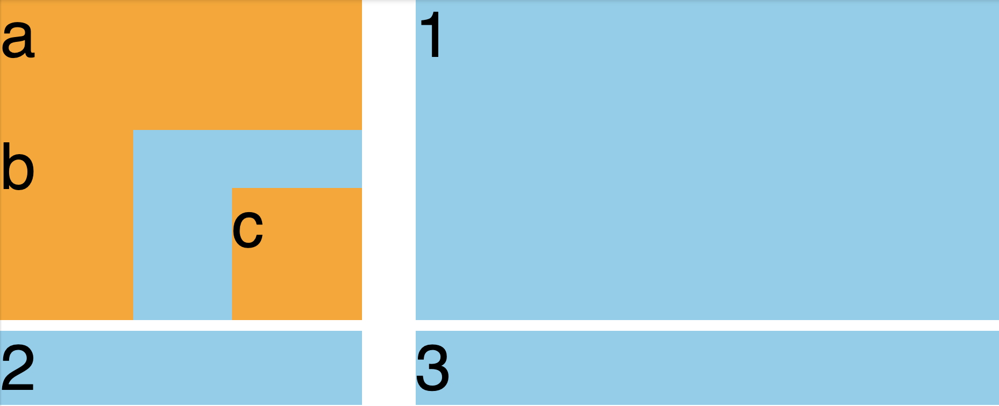

# Выравнивание
- :page_with_curl: [На главную](../../../README.md) 
- :page_with_curl: [Блочные, строчные, блочно-строчные элементы](./block_inline_inline-block.md) 
- :page_with_curl: [Единицы измерения](./units.md) 
- :page_with_curl: [Позиционирование](./position.md) 
- :page_with_curl: [Псевдоклассы и псевдоэлементы. Комбинаторы](./pseudo_classes_pseudo-elements_combinators.md) 
- :page_with_curl: [Специфичность селекторов](./specificity.md) 
- :page_with_curl: [Выравнивание](./specificity.md) 
---
## Классические способы выравнивания
### По горизонтали:
- <b>text-align: center</b>. Простейший способ выровнять текстовый блок. Подходит, если необходимо выровнять просто текст.
- <b>margin: auto + фиксированная ширина</b>. Если блок имеет фиксированные размеры, по горизонтали его можно отцентрировать с помощью margin. Если задать боковым margin значение auto, то их размер будет вычислен таким образом, что блок будет позиционирован по центру родительского блока.
- <b>position: absolute + left: 50% + transform: translateX(-50%)</b>. Математический способ: абсолютно позиционированный блок смещается на 50% ширины родителя, затем с помощью transform перемещается назад на 50% собственной ширины, тем самым занимая центр по горизонтали.
### По вертикали:
- <b>line-height</b>. Простейший способ выровнять текст по вертикали - задать высоту символов равной высоте блока. Подходит, если текст умещается в одной строке.
- <b>vertical-align: middle</b>. Способ выравнивания по вертикали для строчных и блочно-строчных элементов.
- <b>position: absolute + top: 50% + transform: translateY(-50%)</b>. Способ выравнивания с использованием абсолютного позиционирования, аналогичный способу выравнивания по горизонтали.
## Выравнивание: flexbox
Содержимое flex-контейнера может быть позиционировано относительно двух перпендикулярных осей: <b>главной</b> и <b>побочной</b>. В первую очередь flex-элементы располагаются относительно главной оси. Каждый flex-контейнер имеет направление главной оси, которое задается свойством flex-direction и имеет значения:
- row (в ряд слева направо, дефолтное значение);
- column (в столбик сверху вниз);
- row-reverse (в ряд справа налево);
- column-reverse (в столбик снизу вверх).
 
 
 

 
 
На рисунке выше показан flex-контейнер, содержащий 3 дочерних элемента с фиксированными шириной и высотой. Сверху показан контейнер, имеющий направление flex-direction: row, снизу - flex-direction: column.
### Выравнивание относительно главной оси
Для того, чтобы изменить положение содержимого относительно главной оси, используется свойство justify-content. Оно имеет следующие основные значения:
- flex-start (начало главной оси);
- flex-end (конец главной оси);
- center (середина главной оси);
- space-between (одинаковое расстояние между блоками, причем крайние блоки прижаты к краям контейнера);
- space-around (одинаковое расстояние между блоками и вполовину меньшее расстояние между границами блока и крайними блоками);
- space-evenly (одинаковое расстояние как между блоками, так и между крайними блоками и границами).
 
 
 

 
 
- На рисунке выше показано позиционирование блоков свойством justify-content относительно главной оси в порядке перечисления. Главная ось направлена слева направо (flex-direction: row).
### Выравнивание относительно побочной оси
Для того, чтобы позиционировать контент относительно побочной оси, используется свойство align-items. Оно имеет следующие значения:
- flex-start;
- flex-end;
- center;
- stretch (растягивает блоки на всю доступную высоту, если у них не задана высота).
 
 
 

 
 
  На рисунке приведено позиционирование блоков свойством align-items относительно побочной оси в порядке перечисления. Побочная ось направлена сверху вниз (flex-direction: row).
### Другие свойства flex'ов
- <b>flex-wrap</b> - свойство, отвечающее за поведение контента при переносе: nowrap - контент не переносится на новую строку, wrap - переносится, wrap-reverse - переносится инвертировано
- <b>flex-basis</b> - определяет начальный размер элемента. Поскольку flex может сам адаптировать контент, стараясь уместить в заданные размеры, это свойство необходимо, чтобы знать исходный размер элемента по основной оси.
- <b>flex-shrink</b> - свойство для определения степени сжатия элемента. В случае, если контент не влезает в flex-контейнер, у дочерних элементов можно задать это свойство, чтобы определить, как уменьшать их размер. Свойство flex-shrink: 0 будет означать, что блок не будет сжиматься, flex-shrink: 1 - что будет сжиматься так же, как остальные (это дефолтное значение), flex-shrink: 2 - что блок будет сжат в два раза больше, чем остальные (что размер будет в два раза меньше размера соседних блоков)
- <b>flex-grow</b> - аналогично flex-shrink, но отвечает за степень увеличения элемента
По умолчанию flex-контейнер сжимает flex-элементы, поэтому, если вы не ожидаете такого поведения на вашей странице, не забудьте указать flex-элементам свойство flex-shrink: 0.
### Полезные ссылки по flex'ам:
1. [Полный гайд по флексам](https://css-tricks.com/snippets/css/a-guide-to-flexbox/)

  <b><a href="#">↥ Наверх</a></b>

## Выравнивание: grid
Grid-контейнер представляет из себя сетку, состоящую из ячеек, в которых размещаются grid-элементы. На примере ниже такая сетка находится в блоке с классом .grid.
 
 
 

 
 
Ячейками можно управлять, обращаясь к рядам и столбцам сетки. Создав grid-контейнер, можно задать количество рядов и колонок, а также их размеры. Размеры могут быть заданы в любых единицах измерения, в том числе в fr - единицах гибкости гридов, которые, можно сказать, задают пропорции между рядами или колонками, для которых они прописаны. Аналогично можно задавать отступы между ячейками. Контент внутри ячеек можно выравнивать свойствами justify-content и align-items.
 
 
 

 
 
При расстановке элементы сохраняют свой порядок, который можно изменять с помощью явного задания ряда и столбца, где должна находиться ячейка. На примере ниже последний элемент смещается в первую колонку первой строки.
 
 
 

 
 
Можно создавать grid внутри grid. Поведение ячеек, помимо задания столбцов и строк, можно задавать областями. В примере ниже создается вложенный грид с определением внутри него шаблона расстановки областей.
 
 
 

 
 
При этом для каждого вложенного grid-элемента необходимо указать, к какой области он должен быть отнесен.
 
 
 

 
 
В результате получаем вот такую расстновку элементов:
 
 
 

 
 
### Полезные ссылки по grid'ам:
1. [Полный гайд по флексам](https://css-tricks.com/snippets/css/a-guide-to-flexbox/)

  <b><a href="#">↥ Наверх</a></b>

