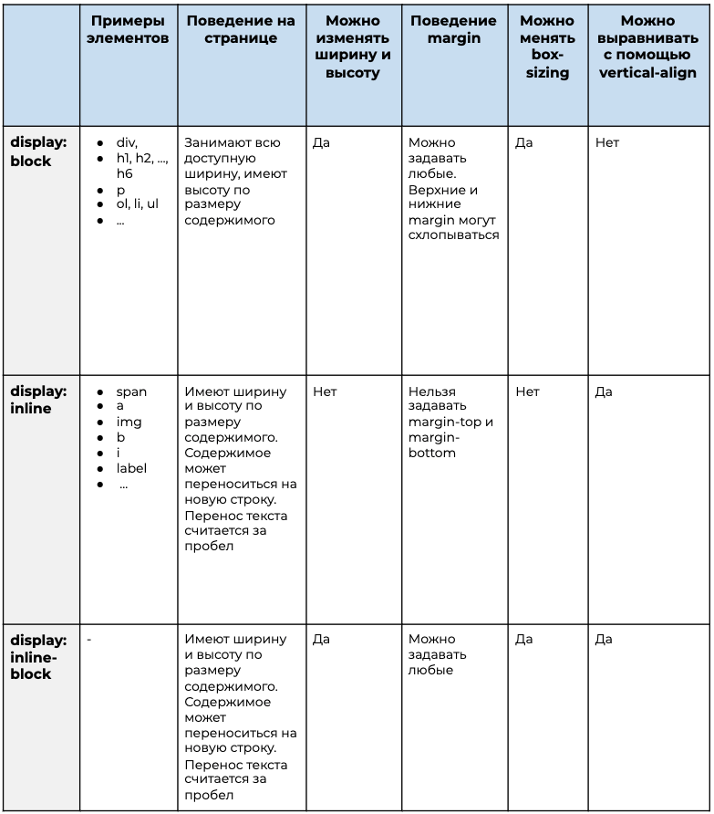

# Блочные, строчные, блочно-строчные элементы
- :page_with_curl: [На главную](../../../README.md) 
- :page_with_curl: [Блочные, строчные, блочно-строчные элементы](./block_inline_inline-block.md) 
- :page_with_curl: [Единицы измерения](./units.md) 
- :page_with_curl: [Позиционирование](./position.md) 
- :page_with_curl: [Псевдоклассы и псевдоэлементы. Комбинаторы](./pseudo_classes_pseudo-elements_combinators.md) 
- :page_with_curl: [Специфичность селекторов](./specificity.md) 
- :page_with_curl: [Выравнивание](./specificity.md) 
---
### 1. Блочные элементы
- Задаются свойством display: block.
- Блочными являются элементы `
, <h1/>...<h6/>, 
, <ol/>, <ul/>` и так далее.
- Ширина блочных элементов равна ширине родительского элемента, высота определяется по содержимому самого блока.
- Можно задавать width и height.
- После себя всегда имеют перенос на новую строку.
- Ширина и высота складываются из значений width/height, margin, padding и border.
- Поддерживают свойство box-sizing: content-box (размеры не включают margin, padding, border) и border-box (размеры включают только padding и border).
- Схлопывание внешних отступов margin-collapsing.

### 2. Строчные элементы
- Задаются свойством display: inline.
- Блочными являются элементы `, <a/>, , <label/>, <b/>, <i/>` и так далее.
- Ширина и высота строчных элементов определяются по размерам содержимого, размеры не включают margin, padding и border.
- Нельзя задавать width и height.
- Перенос на новую строку считается за пробел.
- При необходимости содержимое переносится на новую строку.
- Нельзя задавать верхние и нижние margin.
- Можно выравнивать по вертикали с помощью свойства vertical-align.

### 3. Блочно-строчные элементы

- Задаются свойством display: inline-block.
- По умолчанию ширина и высота строчных  определяются по размерам содержимого.
- Можно задавать width и height.
- Перенос на новую строку считается за пробел.
- При необходимости переносятся на новую строку.
- Ширина и высота складываются из значений width/height, margin, padding и border.
- Поддерживают свойство box-sizing: content-box/border-box.
- Можно выравнивать по вертикали с помощью свойства vertical-align.

## Итого:

### Полезные ссылки:
1. [Свойство box-sizing](https://developer.mozilla.org/ru/docs/Web/CSS/box-sizing)
2. [Схлопывание внешних отступов margin collapsing](https://developer.mozilla.org/ru/docs/Web/CSS/CSS_Box_Model/Mastering_margin_collapsing)
3. [Почему не работает vertical-align?](https://web-standards.ru/articles/vertical-align/)

  <b><a href="#">↥ Наверх</a></b>

