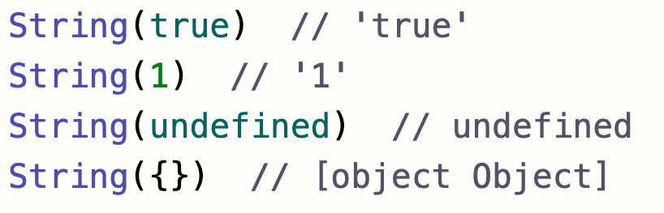
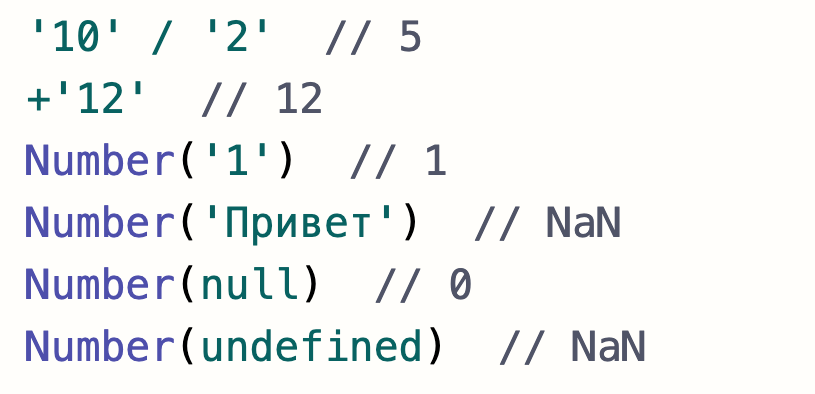
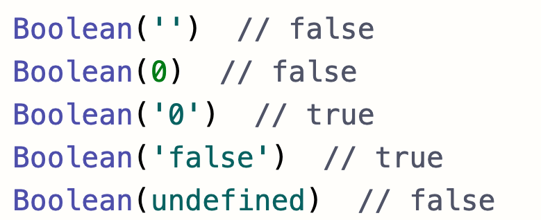

# Типы данных. Преобразование типов. Сравнение
- :page_with_curl: [На главную](../../../README.md) 
- :page_with_curl: [Типы данных. Преобразования типов. Сравнение](.data-types_comparison.md) 
- :page_with_curl: [Переменные](./variables.md) 
- :page_with_curl: [Объекты](./objectss.md) 
- :page_with_curl: [Массивы](./arrays.md) 
- :page_with_curl: [Функции. Контекст. Замыкания, каррирование](./functions_сontext_сarr_сlosures.md) 
- :page_with_curl: [Отложенные действия. Промисы](./delayed-actions_promise.md) 
---
## Типы
### В JavaScript существует 8 типов данных:
- <b>number</b> - целые и дробные числа, включает значения Infinity и NaN;
- <b>Bigint</b> - целые числа состоящие более чем из 16 цифр;
- <b>string</b> - строки;
- <b>boolean</b> - логические значения (true и false);
- <b>null</b> - специальное значение, имеющее смысл неизвестного значения, "ничего";
- <b>undefined</b> - специальное значение, имеющии смысл "значение еще не определено";
- <b>Symbol</b> - уникальные значения;
- <b>object</b> -  сущности "ключ-значение". 

Типы с первого по седьмой являются примитивами, поскольку всегда содержат только одно значение. Тип "object" используется для более сложных сущностей.
## Преобразование типов
- <b>Строковое</b>: String()
 
 
 

 
 
- <b>Численное</b>: Number() или математические операции
 
 
 

 
 
- <b>Логическое</b>: Boolean() или логические операции (например, двойное отрицание - !!)
 
 
 

 
 
## Сравнение
<b>Нестрогое сравнение (==, !=)</b> приводит к числу каждое из указанных значений, в результате игнорируя их исходные типы.
<b>Строгое сравнение (===, !==)</b> осуществляет сравнение без приведения типов, тем самым учитывая при сравнении, что значения имеют разные типы.
### Полезные ссылки
- [Почему typeof null это 'object'](https://2ality.com/2013/10/typeof-null.html)
- [Тип данных Bigint](https://developer.mozilla.org/ru/docs/Web/JavaScript/Reference/Global_Objects/BigInt)
- [Тип данных Symbol](https://developer.mozilla.org/ru/docs/Web/JavaScript/Reference/Global_Objects/Symbol)
- [Больше информации о сравнении](https://learn.javascript.ru/comparison)

  <b><a href="#">↥ Наверх</a></b>

