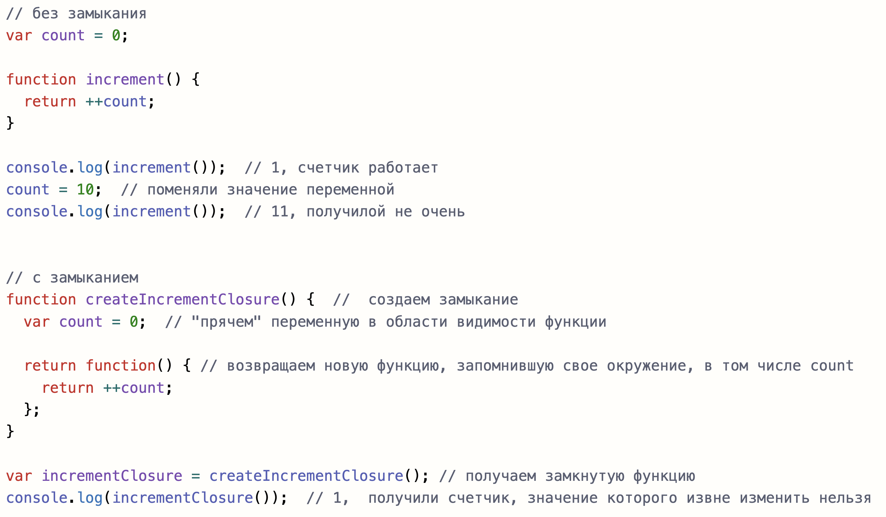
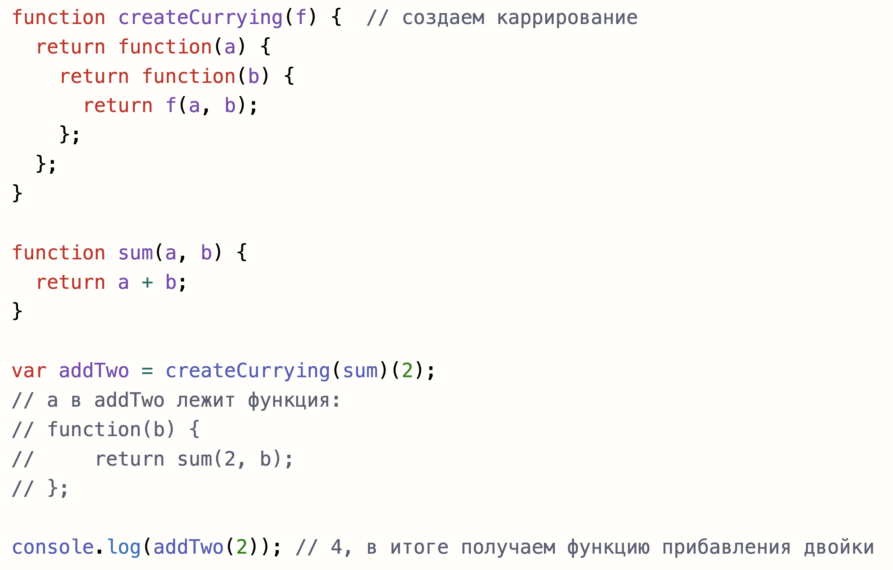

# Функции. Контекст. Замыкания, каррирование
- :page_with_curl: [На главную](../../../README.md) 
- :page_with_curl: [Типы данных. Преобразования типов. Сравнение](.data-types_comparison.md) 
- :page_with_curl: [Переменные](./variables.md) 
- :page_with_curl: [Объекты](./objectss.md) 
- :page_with_curl: [Массивы](./arrays.md) 
- :page_with_curl: [Функции. Контекст. Замыкания, каррирование](./functions_сontext_сarr_сlosures.md) 
- :page_with_curl: [Отложенные действия. Промисы](./delayed-actions_promise.md) 
---
### Функции
<b>Функция - это объект</b>, который позволяет вынести некоторую логику. Функции могут принимать аргументы и возвращать значения.
<b>Параметры в функцию передаются по значению</b>, если это значения примитивны типов, <b>и по ссылке</b>, если это объекты. К аргументам функции можно обращаться с помощью псевдомассива <b>arguments</b> (только для function), либо, если подразумевается неограниченное количество аргументов, можно  обратиться с помощью <b>spread/rest оператора.</b>
Если у функции явно не прописано, какое значение она возвращает, то такая функция возвращает undefined.
<b>Объявления функций</b> могут быть:
- <b>Function Declaration</b> - function foo() { }. Такие функции создаются до выполнения кода и могут быть вызваны до объявления.
- <b>Function Expression</b> - const foo = function() { }. Такие функции до объявления вызвать нелья.

### Контекст
Функции имеют контекст выполнения <b>this</b>. Не в строгом режиме (без 'use strict') для глобальных функций это Window/Global. Для методов объектов this - это сам объект.
Для того, чтобы избежать <b>потери контекста</b>, можно использовать:
- <b>bind()</b> - создание новой функции с фиксированным контекстом;
- <b>call()/apply()</b> - вызов функции с явным указанием контекста;
- <b>стрелочные функции</b> - функции, не имеющие своего this и сохраняющие контекст выполнения своего окружения. Кроме того, такие функции не содержат псевдомассив аргументов arguments.
### Замыкания, каррирование
<b>Замыкание</b> - создание функции, запоминающей свое окружение. Пример:

<b>Каррирование</b> - создание функции, трансформирующей некоторую исходную функцию и возвращающей результат этой трансформации в виде новой функции. Пример:

### Полезные ссылки:
- [Про стандарт ES6](https://habr.com/ru/post/305900/)
- [Отдельно про деструктуризацию](https://learn.javascript.ru/destructuring-assignment)

  <b><a href="#">↥ Наверх</a></b>

