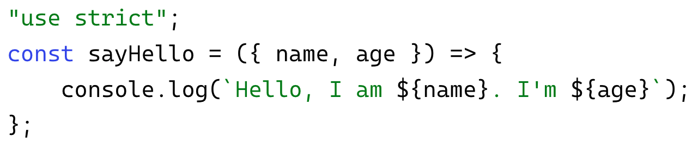

# Знакомство с Typescript
- :page_with_curl: [На главную](../../../README.md)<br>
- :page_with_curl: [Знакомство с TypeScript](./introducing_typescript.md)<br>
- :page_with_curl: [Создание своих типов и манипуляции с ними](./create_own_types.md)<br>
- :page_with_curl: [Интерфейсы. Их взаимодействие с классами. Шаблонизация](./interfaces_templating.md)<br>
---
<b>TypeScript</b> - не отдельный язык, а язык-надстройка со статической строгой типизацией. Он необходим для решения неудобств, которые создает динамическая типизация JavaScript. TypeScript после компиляции превращается в JavaScript и в браузере не исполняется.<br>

Код на TS До превращения в JS:


Тот же код после превращения в JS:

<b></b>

Что делает TypeScript?
- позволяет отлавливать ошибки еще до того, как вы успеваете о них подумать. Строгая типизация значительно сокращает количество возможных ошибок;
- удобно интегрируется с IDE. После подключения TS ваша IDE будет подсказывать переменные и их типы, но и указывать возможные проблемные места;
- расширяет возможности JavaScript в ООП. TypeScript позволяет использовать наследование, абстрактные классы и многое другое;
- компилятор TS позволяет преобразовывать ваш код в JS-код более старых стандартов языка, что повышает поддержку браузерами;
- повышает наглядность и документируемость кода.

<b>Ставим Typescript глобально</b>
```
npm install -g typescript  // ставим TypeScript глобально
tsc index.ts               // компилируем файл с нашим кодом на ts
```

<b>Примеры типизации</b>
```
const str = 'some string';  // переменной присвоится тип значения, с которым она инициализируется
```
```
const sayHi = (name: string): string => `hi, ${name}`; 
// типизируем аргумент функции и ее возвращаемое значение как string
```

<b>Некоторые основные типы TS:</b>
- примитивы - string, number и т.п.;
- any - любой тип;
- unknown - неизвестный на данный момент тип;
- never - тип значения, которого никогда не будет;
- void - тип для возвращаемого значения функции, если она ничего не возвращает.

<div align="right">
  <b><a href="#">↥ Наверх</a></b>
</div>